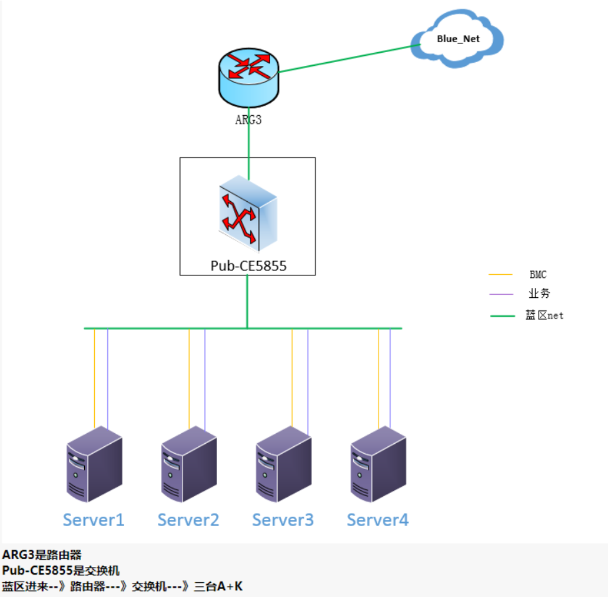

鹏城实验室（PCL）集群基础网络配置
===========================================

0. Device Info

Device | IP            | username | passwd      |root_passwd   | hostname  | Domain         |
|:-----|:--------------|:---------|:------------|:-------------|:----------|:---------------|
CPU    |192.168.100.13 | ascend   | ascend910   |apulis@pcl723 |atlas01    | atlas01.ascend.cn
GPU    |192.168.100.23 | ascend   | ascend910   |apulis@pcl723 |atlas02    | atlas02.ascend.cn
atlas  |192.168.100.33 | ascend   | ascend910   |pcl123#$      |atlas03    | atlas03.ascend.cn


1. Cluster Info

ClusterName| host_name     |device_type|  host_ip      | role         |
|:---------|:--------------|:----------|:--------------|:-------------|
atlas      | atlas01       | NPU       |192.168.100.13 | worker
atlas      | atlas02       | NPU       |192.168.100.23 | worker
atlas      | atlas03       | NPU       |192.168.100.33 | master/worker

2. Hosts LAN Dns, k8s 节点之间域名解析配置

    ```
    127.0.0.1       localhost
    192.168.100.13    atlas01
    192.168.100.13    atlas01.ascend.cn


    192.168.100.23    atlas02
    192.168.100.23    atlas02.ascend.cn


    192.168.100.33    atlas03
    192.168.100.33   atlas03.ascend.cn
    121.37.54.27    atlas.ascend.cn

    # The following lines are desirable for IPv6 capable hosts
    ::1     localhost ip6-localhost ip6-loopback
    ff02::1 ip6-allnodes
    ff02::2 ip6-allrouters
    ```

* 然后在 `/etc/resolv.conf` 添加

    `search ascend.cn`

* CPU, GPU, atlas 节点原配置文件备份：
    ```
    /etc/hosts.bak
    /etc/resolv.conf.bak
    ```
3. 管理员账号

    |username |passwd    |
    |:--------:|:--------|
    admin      | 123456

4. 确认GPU节点nvidia驱动与nvidia-docker均已正常安装
    ```
    nvidia-docker run --rm dlws/cuda nvidia-smi
    docker run --rm -ti dlws/cuda nvidia-smi
    ```

5. 确认Atlas节点NPU状态
    ```
    # npu 连接状态, NPU集群需要检查；单机不需要检查，但是单机NPU卡的IP要按要求配置
    for i in {0..7}; do hccn_tool -i ${i} -link -g; done
    # 使用状态
    npu-smi info
    # npu监控数据
    cat /var/log/npu/npu_smi/device0
    # 查看npu驱动版本
    cat /usr/local/Ascend/version.info
    version=A800-9000-NPU_Driver-20.0.RC1-ARM64-Ubuntu18.04.run
    ```
6. 同步镜像问题

    *拉取docker镜像，需要公司docker hub账号，请联系管理员*

    *如果配置脚本pull失败，则可以手工更新镜像源重新pull镜像。*

* CPU节点：
    ```
    k8s_version="v1.18.0"
    # pull k8s images
    sudo docker pull registry.cn-hangzhou.aliyuncs.com/google_containers/kube-apiserver:${k8s_version}
    sudo docker pull registry.cn-hangzhou.aliyuncs.com/google_containers/kube-controller-manager:${k8s_version}
    sudo docker pull registry.cn-hangzhou.aliyuncs.com/google_containers/kube-scheduler:${k8s_version}
    sudo docker pull registry.cn-hangzhou.aliyuncs.com/google_containers/kube-proxy:${k8s_version}
    sudo docker pull registry.cn-hangzhou.aliyuncs.com/google_containers/etcd:3.4.3-0
    sudo docker pull registry.cn-hangzhou.aliyuncs.com/google_containers/coredns:1.6.7
    sudo docker pull registry.cn-hangzhou.aliyuncs.com/google_containers/pause:3.2

    sudo docker tag registry.cn-hangzhou.aliyuncs.com/google_containers/kube-apiserver:${k8s_version} k8s.gcr.io/kube-apiserver:${k8s_version}
    sudo docker tag registry.cn-hangzhou.aliyuncs.com/google_containers/kube-controller-manager:${k8s_version} k8s.gcr.io/kube-controller-manager:${k8s_version}
    sudo docker tag registry.cn-hangzhou.aliyuncs.com/google_containers/kube-scheduler:${k8s_version} k8s.gcr.io/kube-scheduler:${k8s_version}
    sudo docker tag registry.cn-hangzhou.aliyuncs.com/google_containers/kube-proxy:${k8s_version} k8s.gcr.io/kube-proxy:${k8s_version}
    sudo docker tag registry.cn-hangzhou.aliyuncs.com/google_containers/etcd:3.4.3-0 k8s.gcr.io/etcd:3.4.3-0
    sudo docker tag registry.cn-hangzhou.aliyuncs.com/google_containers/coredns:1.6.7 k8s.gcr.io/coredns:1.6.7
    sudo docker tag registry.cn-hangzhou.aliyuncs.com/google_containers/pause:3.2 k8s.gcr.io/pause:3.2
    }
    ```
* GPU节点
    ```
    k8s_version="v1.18.0"
    sudo docker pull registry.cn-hangzhou.aliyuncs.com/google_containers/kube-apiserver:${k8s_version}
    sudo docker pull registry.cn-hangzhou.aliyuncs.com/google_containers/kube-controller-manager:${k8s_version}
    sudo docker pull registry.cn-hangzhou.aliyuncs.com/google_containers/kube-scheduler:${k8s_version}
    sudo docker pull registry.cn-hangzhou.aliyuncs.com/google_containers/kube-proxy:${k8s_version}
    sudo docker pull registry.cn-hangzhou.aliyuncs.com/google_containers/etcd:3.4.3-0
    sudo docker pull registry.cn-hangzhou.aliyuncs.com/google_containers/coredns:1.6.7
    sudo docker pull registry.cn-hangzhou.aliyuncs.com/google_containers/pause:3.2

    sudo docker tag registry.cn-hangzhou.aliyuncs.com/google_containers/kube-apiserver:${k8s_version} k8s.gcr.io/kube-apiserver:${k8s_version}
    sudo docker tag registry.cn-hangzhou.aliyuncs.com/google_containers/kube-controller-manager:${k8s_version} k8s.gcr.io/kube-controller-manager:${k8s_version}
    sudo docker tag registry.cn-hangzhou.aliyuncs.com/google_containers/kube-scheduler:${k8s_version} k8s.gcr.io/kube-scheduler:${k8s_version}
    sudo docker tag registry.cn-hangzhou.aliyuncs.com/google_containers/kube-proxy:${k8s_version} k8s.gcr.io/kube-proxy:${k8s_version}
    sudo docker tag registry.cn-hangzhou.aliyuncs.com/google_containers/etcd:3.4.3-0 k8s.gcr.io/etcd:3.4.3-0
    sudo docker tag registry.cn-hangzhou.aliyuncs.com/google_containers/coredns:1.6.7 k8s.gcr.io/coredns:1.6.7
    sudo docker tag registry.cn-hangzhou.aliyuncs.com/google_containers/pause:3.2 k8s.gcr.io/pause:3.2
    ```


7. 集群状态检查

* 查看集群节点状态

`kubectl get nodes`

* 检查集群pod状态

`kubectl get pods -n kube-system`

* 检查平台服务组件pod状态

`kubectl get pods`

8. 网络示例
