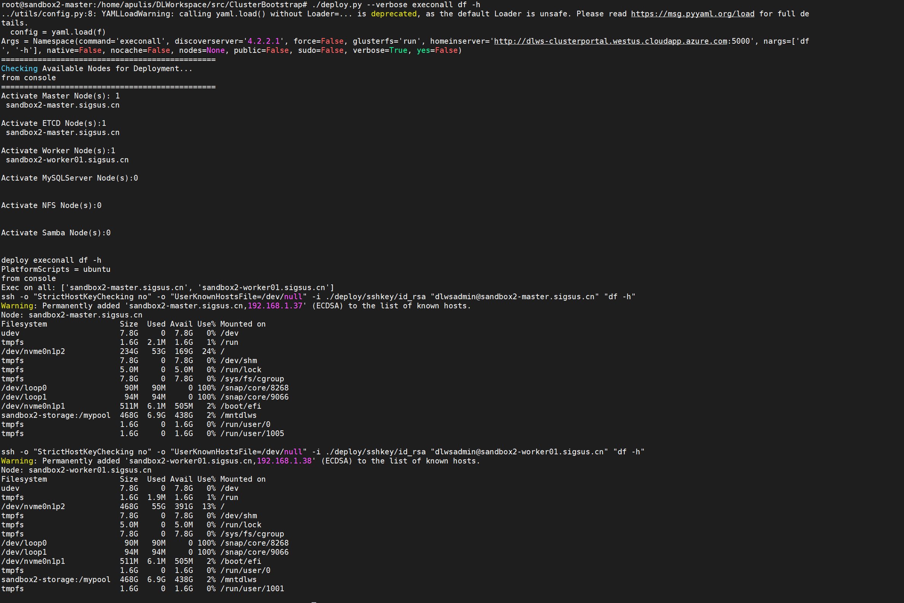
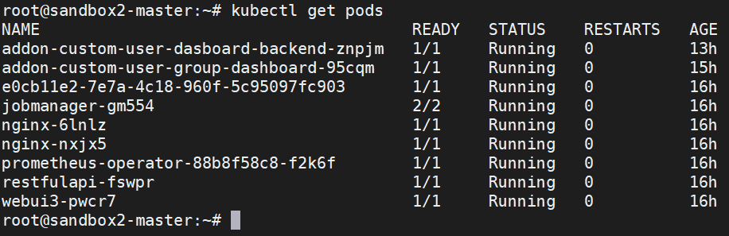
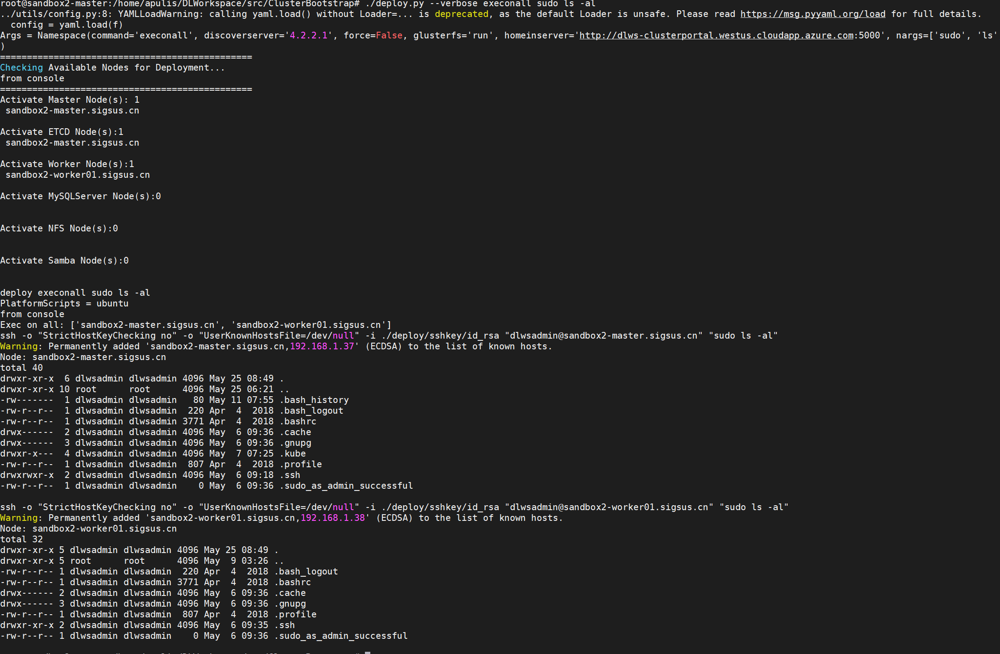

Apulis Platform x86多节点环境部署指导
=========================================================================

### 版本更新记录

  | 版本号 |	更新时间 |	主要内容或重大修改 | 修改人 |
  | :------:| :------: | :------: |:------: |
  0.0.8	| 2020年05月27日	| 初稿 | bifeng
  0.1.0	| 2020年07月03日	| 终稿 | haiyuan

### 商标和版权 

  "Apulis Platform",“依瞳人工智能平台”及图标是依瞳科技有限公司的商标或注册商标。

  在本用户手册中描述的随机软件，是基于最终用户许可协议的条款和条件提供的，只能按照该最终用户许可协议的规定使用和复制。 
  本手册受到著作权法律法规保护，未经依瞳科技有限公司事先书面授权，任何人士不得以任何方式对本手册的全部或任何部分进行复制、抄录、删减或将其编译为机读格式，以任何形式在可检索系统中存储，在有线或无线网络中传输，或以任何形式翻译为任何文字。 

### 文档简介  

  本文档支持用户半自动化完成网络配置，系统设置，平台的集群环境和基础应用的安装，以及平台版本更新和配置备份和恢复。其中涉及linux系统配置，GPU,NPU驱动安装，docker, k8s集群安装和平台集群部署。要求参与部署的运维人员熟悉linux,docker，和k8s等。

## 术语、定义和缩略语

  | 词语 | 解释 |
  |:---|:--|
  集群 | 包含调度器、计算节点等在内的资源的统称，名称与调度器相同。 
  Job | 完成特定任务的命令序列。 
  任务状态 |  指深度学习任务在调度系统中的状态，包括等待、运行、终止、完成、失败。 
  节点状态 |  指计算节点在调度系统中的状态，包括空闲、已占用、繁忙、下线、停机、未知。  
  worker |  运行执行进程的节点。 


## 安装环境要求

  * 系统：ubuntu 18.04 server
  * 用户：root 用户,或具备sudo权限的非ROOT用户,所有机器允许root登录
  * 软件：预安装 ssh-server
  * 硬件：Secure Boot 需禁用(一般x86主板启动有该选项，请在开机bose启动时去掉勾选项）
  * 步骤说明：执行时如提示无权限,则使用sudo权限执行
  * 部署脚本默认 python2.7
  * Apulis AI Platfom release-0.1.0


 集群环境配置
-------------------------------------------------------------------------

1. 集群网络规划

    名称 |	配置| 	GPU |	操作系统 |	公网IP |	子网IP |	描述
    |--|--|--|--|--|--|--|
    dev master |	6C64G |	N/A |	ubuntu 18.04 |	121.46.18.83 |	192.168.1.3 |	部署发起节点 k8s master节点
    worker-01 |	36C512G |	8 |	ubuntu 18.04 |	121.46.18.83 |	192.168.1.8 |	k8s worker节点
    worker-02 |	36C512G |	8 |	ubuntu 18.04 |	121.46.18.83 |	192.168.1.9 |	k8s worker节点

    **其中：**
 
        master和worker需在同一个子网或VPC，dev与master、worker可以不在同一个子网或VPC

        worker节点需携带GPU，GPU类别为Nvidia，安装驱动（driver）版本>= 430

2. sudo 免密码配置

    ```
    #针对非root用户，需在dev、master、worker三个机器中配置

    sudo visudo

    # 检查文件内容，确认是否存在以下配置，没有则新增  

    %sudo ALL=(ALL:ALL) ALL
    %sudo ALL=(ALL) NOPASSWD:ALL
    ```

3. 配置节点 Hostname

    在master、worker以及master节点中分别配置主机名

    ```
    sandbox03-master

    sandbox03-worker1

    sandbox03-worker2

    sandbox03-storage
    ```

    配置方法（依sandbox03-master为例子）：

        更新/etc/hostname内容为: sandbox03-master

        设置hostname立即生效：sudo hostnamectl set-hostname sandbox03-master

4. 配置节点 DNS

    * 需要在DNS提供商控制台进行配置

      DNS 提供商：https://dns.console.aliyun.com

      主域名：sigsus.cn

      示例：
      主机记录 	记录类型 	记录值 	对应节点(参考)

    ```
    sandbox03-master 	A 	121.46.18.83 	master
    sandbox03-worker01 	A 	121.46.18.83 	woker01
    sandbox03-worker02 	A 	121.46.18.83 	woker02
    ```

5. 配置服务器所在时区
    ```
    # 查看时区
    date -R 
    # 配置为北京时区

    tzselect    # 按提示选择时区

    cp /usr/share/zoneinfo/Asia/Shanghai  /etc/localtime

    ```

执行安装配置
-------------------------------------------------------------------------

1. 文件/路径说明
 
    ```
    # 安装程序所在目录 ：
    src/ClusterBootstrap/
    # 集群配置文件：
    src/ClusterBootstrap/config.yaml
    # 安装文件：
    src/ClusterBootstrap/deploy.py
    ```

2. 设置集群配置文件

    **以下字段需做相应修改**

    * cluster_name —— 集群名称

    * cloud_influxdb_node —— master节点FQDN

    * DeployAuthentications —— 登录方式（如有微信，[微软登录方式参数获取参考](https://github.com/apulis/dev_document/tree/master/dlts/redirect_url_registration)需相应增加）

    * DLWSAdmins —— 增加对应的管理员名称

    * mysql_password —— 修改为指定的密码

    * machines
        + sandbox03-master —— private-id —— 修改为对应master节点的内网IP
        + type和vendor —— 更改为对应的硬件和厂家名

    * dockerregistry —— 更改为对应的docker hub

    * onpremise_cluster
        + worker_node_num —— 更改为worker节点数
        + gpu_count_per_node —— 更改为节点gpu数量

    * mountpoints
        + server —— 更改为数据节点的短域名
        + filesharename —— 挂载点目录名（可不更改）

    * nfs_disk_mnt
        + 更改为master节点短域名

    * <span id="jumpgithub">配置 github private accout </span>

          ```
          dockers:
            hub: apulistech/
            user: apulis
            password: apulistech
          ```
    * extranet_protocol —— jupyter或tensorboard
    * extranet_port —— jupyter或tensorboard的映射端口

    **config.yaml样例**

    ```
    cluster_name: sandbox02-gpu01

    network:
      domain: sigsus.cn
      container-network-iprange: "10.0.0.0/8"

    etcd_node_num: 1
    mounthomefolder : True

    # These may be needed for KubeGPU
    # # kube_custom_cri : True
    # # kube_custom_scheduler: True
    kubepresleep: 1
    cloud_influxdb_node: sandbox2-master.sigsus.cn

    DeployAuthentications:
    - Microsoft

    UserGroups:
      DLWSAdmins:
        Allowed:
        - bifeng.peng@apulis.com
        - yunxia.chu@apulis.com
        gid: "20001"
        uid: 20000-20004
      DLWSRegister:
        Allowed:
        - '@apulis.com'
        - '@outlook.com'
        - '@hotmail.com'
        gid: "20001"
        uid: 20005-29999

    WebUIadminGroups:
    - DLWSAdmins

    WebUIauthorizedGroups:
    - DLWSAdmins

    WebUIregisterGroups:
    - DLWSRegister

    WinbindServers: []

    datasource: MySQL
    mysql_password: corona@2020@wuhan
    webuiport: 3081
    useclusterfile : true
    platform-scripts : ubuntu


    machines:
      sandbox2-master:
        role: infrastructure
        private-ip: 192.168.1.37
      sandbox2-worker01:
        role: worker
        type: gpu
        vendor: nvidia

    admin_username: dlwsadmin

    # settings for docker
    dockerregistry: apulistech/
    dockers:
      hub: apulistech/
      user: apulis
      password: apulistech

    cloud_config:
      dev_network:
        source_addresses_prefixes: [ "66.114.136.16/29", "73.140.21.119/32"]
      default_admin_username: dlwsadmin
      dev_network:
        source_addresses_prefixes:
        - 66.114.136.16/29
        - 73.140.21.119/32
        tcp_port_ranges: 22 1443 2379 3306 5000 8086 10250 10255 22222
      inter_connect:
        tcp_port_ranges: 22 1443 2379 3306 5000 8086 10250
      nfs_share:
        source_ips:
        - 116.66.187.0/24
      nfs_ssh:
        port: 22
      tcp_port_for_pods: 30000-49999
      tcp_port_ranges: 80 443 30000-49999 25826 3000 22222 9091 9092
      udp_port_ranges: '25826'
      vnet_range: 116.66.187.0/24

    cloud_elasticsearch_node: sandbox03.sigsus.cn
    cloud_elasticsearch_port: '9200'

    cloud_influxdb_port: '8086'
    cloud_influxdb_tp_port: '25826'

    custom_mounts: []
    data-disk: /dev/[sh]d[^a]
    dataFolderAccessPoint: ''


    defalt_virtual_cluster_name: platform
    default-storage-folders:
    - jobfiles
    - storage
    - work
    - namenodeshare

    deploymounts: []

    discoverserver: 4.2.2.1
    dltsdata-storage-mount-path: /dltsdata
    dns_server:
      azure_cluster: 8.8.8.8
      onpremise: 8.8.8.8

    Authentications:
      Microsoft:
        TenantId: 19441c6a-f224-41c8-ac36-82464c2d9b13
        ClientId: 487f34da-74af-4c0d-85d9-d678a118d99d
        ClientSecret: "1MZ[7?g0vPv_6cahAvPuohwuQKrrJEh."

      DingTalk:
        AppId: dingoap3bz8cizte9xu62e
        AppSecret: sipRMeNixpgWQOw-sI6TFS5vdvtXozY3y75ik_Zue2KGywfSBBwV7er_8yp-7vaj

      Wechat:
        AppId: wx403e175ad2bf1d2d
        AppSecret: dc8cb2946b1d8fe6256d49d63cd776d0

    supported_platform:  ["onpremise"]
    onpremise_cluster:
      worker_node_num:    1
      gpu_count_per_node: 1
      gpu_type:           nvidia


    mountpoints:
      nfsshare1:
        type: nfs
        server: sandbox03-storage
        filesharename: /data/nfsshare
        curphysicalmountpoint: /mntdlws
        mountpoints: ""

    nfs_disk_mnt:
      sandbox03-storage:
        fileshares:
        - nfsshare
        path: /data/nfsshare/
        role: nfs

    nfs_client_CIDR:
      node_range:
      - 116.66.187.0/24

    basic_auth: d368c36acb3343b4,admin,1000
    deploydockerETCD: false

    k8sAPIport: 6443
    k8s-gitbranch: v1.18.0
    deploy_method: kubeadm

    repair-manager:
      ecc_rule:
        cordon_dry_run: True
      alert:
        smtp_url: smtp.office365.com
        login: dev@apulis.com
        smtp_url: smtp.office365.com
        login: dev@apulis.com
        password: Yitong#123
        sender: dev@apulis.com
        receiver: ["181330729@qq.com"]
        
    jwt:
      secret_key: "Sign key for JWT"
      algorithm: HS256
      token_ttl: 86400

    extranet_protocol: http
    extranet_port: 52080

    ```

3. 安装部署脚本执行环境

    ```
    ./scripts/prepare_ubuntu_dev.sh
    ```

4. 配置 DNS 内网解析 - 1

    * 建议在以下机器：master、worker、storage 三台服务器都配置hosts

    ```
    # 创建目录：mkdir -p /etc/resolvconf/resolv.conf.d/
    # 
    # 修改文件：vim /etc/resolvconf/resolv.conf.d/base
    # 
    # 增加数据：search sigsus.cn
    # 执行指令：sudo resolvconf -u
    # apt install openresolv   # 如果提示 resolvconf 命令找不到
    # apt install resolvconf
    # 
    # 配置节点hosts文件（在集群共享一个公网IP且Router不具备短域名或局域网内DNS配置功能）
    # 
    # 执行：mkdir -p deploy/etc
    # 
    # 路径：DLWorkspace/src/ClusterBootstrap/deploy/etc/hosts
    # 
    # 作用：实现内网DNS解析

    127.0.0.1       localhost
    127.0.1.1       ubuntu

    192.168.1.31     sandbox03-master
    192.168.1.32     sandbox03-worker01
    192.168.1.33     sandbox03-storage

    192.168.1.31    sandbox03-master.sigsus.cn
    192.168.1.32    sandbox03-worker01.sigsus.cn
    192.168.1.33    sandbox03-storage.sigsus.cn

    # The following lines are desirable for IPv6 capable hosts
    ::1     localhost ip6-localhost ip6-loopback
    fe00::0 ip6-localnet
    ff00::0 ip6-mcastprefix
    ff02::1 ip6-allnodes
    ff02::2 ip6-allrouters
    ```


    * 执行hosts文件配置（deploy.py位于DLWorkspace/src/ClusterBootstrap/）

    ```
    sudo cp ./deploy/etc/hosts  /etc/hosts
    ```

5. 创建集群 ID

    ```
    ./deploy.py --verbose -y build 
    ```

6. 配置节点 ROOT 用户密码

    ```
    # 将集群节点ROOT密码设置一致，然后执行指令：
    # 
    # （此步骤用于为每个节点 创建安装用户）

    cd deploy/sshkey
    echo "root" > "rootuser"
    echo "your_root_password" > "rootpasswd"
    ```

  * 配置设置为允许root远程SSH登录

    ```
    # 需要在 master, worker, sotrage 等节点都要配置
    root@ubuntu:~# vim /etc/ssh/sshd_config
    # 将PermitRootLogin prohibie-password 修改为：PermitRootLogin yes 。
    /etc/init.d/ssh restart
    ```

7. 安装SSH Key到所有节点

    ```
    ./deploy.py --verbose sshkey install
    ```

8. 配置 DNS 内网解析 - 2

    ```
    ./deploy.py --verbose copytoall ./deploy/etc/hosts  /etc/hosts

    # 检查DNS配置在master、proxy上指令执行看是否成功

      ping sandbox03-master
      ping sandbox03-worker01
      ping sandbox03-storage
    ```

9. 检查集群节点是否可正常访问

    ```
    ./deploy.py --verbose execonall sudo ls -al
    ```

10. 设置集群节点的安装环境

    ```
    # 这一步骤要确认 worker 节点，如果是x86先要禁用secure boot；然后多尝试几次
    ./deploy.py --verbose runscriptonall ./scripts/prepare_ubuntu.sh

    # 上一个语句会重启 worker 节点。需等待所有服务器 启动完毕，再执行以下步骤！！
    ./deploy.py --verbose runscriptonall ./scripts/prepare_ubuntu.sh continue
    ./deploy.py --verbose execonall sudo usermod -aG docker dlwsadmin

    # 其中：
    #
    #    dlwsadmin为操作集群机器所采用的用户名，配置于config.yaml
    #    如果nvidia驱动安装不成功，可能与具体的设备配置有关，譬如secure boot问题等等，请联系开发人员定位和完善
    ```

11. 部署 NVidia 插件

    ```
    ./deploy.py --verbose kubernetes start nvidia-device-plugin
    ```

12. Worker 机器状态确认


    12.1. 保证以下两条指令均能够正常输出，才表明nvidia驱动与nvidia-docker均已正常安装
      ```
      nvidia-docker run --rm dlws/cuda nvidia-smi

      docker run --rm -ti dlws/cuda nvidia-smi
      ```

    12.2. 问题定位
      ```
      #   如docker指令执行正常，但nvidia-docker指令执行错误，则修改/etc/docker/daemon.json，
      #   将nvidia-docker设置为default runtime

      vim /etc/docker/daemon.json
      {
          "default-runtime": "nvidia",
          "runtimes": {
              "nvidia": {
                  "path": "nvidia-container-runtime",
                  "runtimeArgs": []
              }
          }
      }
        
      #  然后重启docker：

        systemctl daemon-reload
        systemctl restart docker
      ```

13. 安装 kubeadm 客户端

    ```
    # 首先会检查并清除已有的安装包
    ./deploy.py runscriptonroles infra worker   ./scripts/install_kubeadm.sh
    ```

14. 安装 K8S 集群平台

    ```
    # 各节点关闭swap

    ./deploy.py --verbose execonall sudo swapoff -a

    # master节点永久关闭swap

    sed -i.bak '/ swap / s/^\(.*\)$/#\1/g' /etc/fstab

    # 安装集群基础软件

    ./deploy.py --verbose execonall docker pull dlws/pause-amd64:3.0
    ./deploy.py --verbose execonall docker tag  dlws/pause-amd64:3.0 gcr.io/google_containers/pause-amd64:3.0
    
    # 默认生成配置在/root/.kube/config下，后续步骤执行如果发现找不到配置文件，需注意此步骤
    ./deploy.py --verbose kubeadm init
    ./deploy.py --verbose copytoall ./deploy/sshkey/admin.conf /root/.kube/config

    # 加入 worker,或storage节点
    ./deploy.py --verbose kubeadm join
    
    # 设置集群节点标签
    ./deploy.py --verbose -y kubernetes labelservice
    ./deploy.py --verbose -y labelworker
    ```

15. 挂载存储节点

    ```
    # 安装NFS服务（所有节点，包括存储点）

    sudo apt-get update
    sudo apt-get install -y nfs-kernel-server nfs-common portmap
    sudo ln -s /etc/init.d/nfs-kernel-server /etc/init.d/nfs

    /etc/init.d/nfs-kernel-server restart

    # 配置挂载目录（存储节点）

    # 创建目录。假设所要挂载的目录是：/data/nfsshare

    # 挂载目录需与config.yaml中所配置一致

    mountpoints:

      nfsshare1: 
        type: nfs 
        server: storage-server 
        filesharename: /data/nfsshare 
        curphysicalmountpoint: /mntdlws 
        mountpoints: ""

    # 执行：

    mkdir -p /data/nfsshare

    # 设置白名单

    # 编辑文件 /etc/exports，并增加挂载目录的IP白名单

    /data/nfsshare 192.168.1.0/24(rw,fsid=0,insecure,no_subtree_check,async,no_root_squash)

    # 更新共享信息

    sudo exportfs -a

    # 执行挂载

    ./deploy.py --verbose mount
    # 如果执行超时，或提示文件已存在的错误，请直接执行以下 cmd:
      mount sandbox03-storage:/data/nfsshare /mntdlws -o rsize=8192,timeo=14,intr,tcp
    ```

  * 挂载结果确认，每个节点可看到/data/nfsshare被挂载

    `./deploy.py --verbose execonall df -h`

      


16. 重置 APIServer NodePort 端口段

    ```
    # 编辑文件/etc/kubernetes/manifests/kube-apiserver.yaml
    # 增加指定参数：

    - --service-node-port-range=30000-49999

    # 保存文件后，API-SERVER自动重启并生效
    ```

17. 设置 webui 服务配置文件

    **文件路径：DLWorkspace/src/dashboard/config/local.yaml**

    **domain、casUrl以及clusters，三者需依据集群实际的域名，做相应的修改**
    ```
    # 内容示例：

    sign: "apulistechjwtsecretsample001"
    winbind: "Will call /domaininfo/GetUserId with userName query to get the user's id info"
    masterToken: "Access token of all users"

    AddGroupLink: http://add-group/
    WikiLink: http://wiki/

    authEnabled:
      wechat: 1
      microsoft: 1

    wechat:
      appId: "wx403e175ad2bf1d2d"
      appSecret: "dc8cb2946b1d8fe6256d49d63cd776d0"

    userGroup:
      type: custom
      domain: https://apulis-test.sigsus1.cn:51444
      backEndPath: /custom-user-dashboard-backend
      frontEndPath: /custom-user-dashboard

    activeDirectory:
      tenant: "19441c6a-f224-41c8-ac36-82464c2d9b13"
      clientId: "6d93837b-d8ce-48b9-868a-39a9d843dc57"
      clientSecret: "eIHVKiG2TlYa387tssMSj?E?qVGvJi[]"

    dingtalk:
      appId: "dingoap3bz8cizte9xu62e"
      appSecret: "sipRMeNixpgWQOw-sI6TFS5vdvtXozY3y75ik_Zue2KGywfSBBwV7er_8yp-7vaj"
      domain: "http://sandbox2-master.sigsus.cn"
      casUrl: "http://apulis-dev-infra01.westus.cloudapp.azure.com/cas"

    administrators:
      - jinlmsft@hotmail.com
      - jeck@apulis.com
      - tom@apulis.com

    clusters:
      apulis-dev:
        restfulapi: "http://sandbox2-master.sigsus.cn:52080/apis"
        title: Grafana-endpoint-of-the-cluster
        workStorage: work
        dataStorage: data
        grafana: "http://sandbox2-master.sigsus.cn:52080/endpoints/grafana/"
        prometheus: http://sandbox2-master.sigsus.cn:9091


    ```

部署集群应用
-------------------------------------------------------------------------

1. 登录 docker hub （用户名为config.yaml所配置）

    ```
    # 如果之前已配置登陆秘钥，应该会自动登陆成功；否则应该咨询管理员账号
    docker login
    ```

  * 私有 docker 仓库配置(需参考)

    a. 需要修改/etc/docker/dameon.json

    b. 配置文件config.yaml需要添加参数：enable_custom_registry_secrets: True

    c. 最后重启jobmanager


2. 生成 dashboard, jobmanager 等服务的配置文件

    ```
    ./deploy.py --verbose webui         
    ```

3. 编译 restfulapi 和 webui3 服务

    ```
    ./deploy.py --verbose docker push restfulapi2
    # 请注意 webui3 依赖 urllib3==1.2.2
    ./deploy.py --verbose docker push webui3
    ```
    **注意 custom-user-dashboard 不是开放使用的组件，需要配置有权限的[github private](#jumpgithub)账号**

    ```
    ./deploy.py --nocache docker push custom-user-dashboard-frontend
    ./deploy.py --nocache docker push custom-user-dashboard-backend
    ```

4. 编译 GPU Reporter

    ```
    ./deploy.py --verbose docker push gpu-reporter
    ```

5. 编译 Job 容器的依赖容器（请参考 DLWorkspace/src/ClusterBootstrap/step_by_step.sh）：

    ```
    ./deploy.py --verbose docker push init-container
    ```

6. 配置 Nginx

    ```
    ./deploy.py --verbose nginx fqdn
    ./deploy.py --verbose nginx config
    ```

7. 启动集群应用

    ```
    ./deploy.py --verbose kubernetes start mysql jobmanager2 restfulapi2 monitor nginx custommetrics
    ./deploy.py --verbose kubernetes start cloudmonitor
    ```

8. 启用JWT加密组件

    ```
    # Master 为 AMD64 架构
    ./deploy.py --verbose docker push openresty
    # Master 为 ARM64 架构
    ./deploy.py --verbose --archtype arm64 docker push openresty
    # 启用openresty pod
    ./deploy.py kubernetes start openresty
    ```

9. 启用报警模：
 
    ```
    # 1. 编译报警模块
    ./deploy.py --verbose docker push repairmanager2
    # 2. 启用报警模块
    ./deploy.py kubernetes start repairmanager2
    ```

10. 启动 dashboard

    ```
    ./deploy.py --verbose nginx webui3
    ./deploy.py --verbose kubernetes start webui3
    ./deploy.py kubernetes start custom-user-dashboard
    ```


检查集群节点是否可正常访问
-------------------------------------------------------------------------

* k8s 节点状态检查

    ```
    kubectl get pods
    ```
    

    ```
    ./deploy.py --verbose execonall sudo ls -al

    ```
    

备份和恢复配置
-------------------------------------------------------------------------

* 备份配置

    ```
    cd /DLWorkspace/src/ClusterBootstrap
    ./deploy.py backup [backup_file_prefix] [password]
    ```

* 恢复配置
    ```
    ./deploy.py restore [backup_file] [password]
    ```

重置安装环境
-------------------------------------------------------------------------

* 重置 master 节点；如有需要推荐使用系统重装

  `kubeadm reset`
  `rm -rf /etc/cni/net.d/`
* 重置 worker 节点
    ```
    cd DLWorkspace/src/ClusterBootstrap
    ./deploy.py kubeadm reset
    ```


升级平台
-------------------------------------------------------------------------

### 前端

1. 切换版本分支：

    ``` git checkout -b xxx ```

3. 生成 dashboard, jobmanager 等服务的配置文件

    ```
    # 如果单独更新后端，该配置也要重新生成
    ./deploy.py --verbose webui         
    ```   

4. 编译并推送 docker hub：

    ``` ./deploy.py --verbose docker push webui3 ```
   
5. 停止服务：

    ``` ./deploy.py --verbose kubernetes stop webui3 ```

6. 挂载静态资源至 Nginx

    ``` ./deploy.py --verbose nginx webui3 ```

7. 启动服务

    ``` ./deploy.py --verbose kubernetes start webui3 ```


### 后端

1. 切换目录： 

    ```shell cd DLWorkspace/src/ClusterBootstrap/ ```

2. 编译并推送 Registry（以restfulapi2为例)

    ```
    ./deploy.py --verbose docker push restfulapi2
    ```

4. 重启服务

    ```
    ./deploy.py --verbose kubernetes stop restfulapi2 jobmanager2
    ./deploy.py --verbose kubernetes start restfulapi2 jobmanager2
    ```


清除集群信息(***高危操作***)
-------------------------------------------------------------------------
    + 清除所有的worker信息

      `./deploy.py kubeadm reset`

    + 清除master集群信息

      ```
      kubeadm reset
      rm -rf /etc/cni/net.d/&&rm -rf $HOME/.kube
      ## kubectl --kubeconfig=./deploy/sshkey/admin.conf label nodes --overwrite atlas02 custom-user-dashboard-frontend=active
      ## ./deploy/sshkey/admin.conf
      ```

    + 卸载共享盘

      `./deploy.py mount stop`

    + 清除master的配置信息

      ```
      ./deploy.py cleanmasteretcd
      ./deploy.py clean
      ```
FAQ
-------------------------------------------------------------------------
* k8s reset 后 ` x509: certificate signed by unknown authority `
  rm -rf $HOME/.kube
  export KUBECONFIG=/etc/kubernetes/kubelet.conf
  docker login 


* 使用私有镜像库

  1. 在提交 job 的 Advanced ——》Custom Docker Registry 中配置私有镜像

  2. 在 master 主机母系统的 docker 配置文件 /etc/docker/daemon.json 中指定私有镜像库

  3. 在返回 job 提交页面的 docker image 配置项中指定私有镜像库的镜像，前缀必须有私有镜像库链接


* image pull backoff

  + 当更新或安装平台时，出现该错误可以在（配置/私有）docker hub查看镜像是否编译并push成功
  + ```kubectl describe po -n <namespace> <podname> ```查看错误详情，如果时相关依赖镜像拉取失败则会重试的

* mysql 连接问题

  1. 无法访问或权限问题

      ```
      # 方法一：
      # 1.进入 mysql：
      /usr/local/mysql/bin/mysql -u root -p
      # 2.使用 mysql库 ：
      use mysql;
      # 3.查看用户表 ：
      SELECT `Host`,`User` FROM user;
      # 4.更新用户表 ：
      UPDATE user SET `Host` = '%' WHERE `User` = 'root' LIMIT 1;
      # 5.强制刷新权限 ：
      flush privileges;

      # 方法二
      use mysql;
      create user 'root'@'%' identified by '';
      grant all privileges on *.* to 'root'@'%' with grant option;
      flush privileges;
      alter user 'root'@'%' identified with mysql_native_password by 'apulis#2019#wednesday';
      ```
  2. 账号错误
    + 修改修改需要访问Mysql的组件的docker file中mysql配置，需要重新编译镜像
    + 重置相关 mysql 账号密码

  3. mysql 初始化失败

      ```
      查看 /var/lib/mysql 下是否有遗留文件，如果有则清楚。一般在 master 节点上。
      rm -rf /var/lib/mysql
      ```

* 登录页返回未认证或空白，需要修正前端配置的链接, 注意https 或端口配置
  ```
  vim /etc/WebUI/local.yaml

  clusters:
    sandbox03-master:
        restfulapi: "http://sandbox03-master.sigsus.cn/apis"
        title: Grafana-endpoint-of-the-cluster
        workStorage: work
        dataStorage: data
        grafana: "http://sandbox03-master.sigsus.cn:52010/endpoints/grafana/"
        prometheus: http://sandbox03-master.sigsus.cn:9091
  userGroup:
    type: custom
    domain: "http://sandbox03-master.sigsus.cn"
    backEndPath: /custom-user-dashboard-backend
    frontEndPath: /custom-user-dashboard

  ```
* x.509 证书的问题
    `export KUBECONFIG=/etc/kubernetes/admin.conf`
