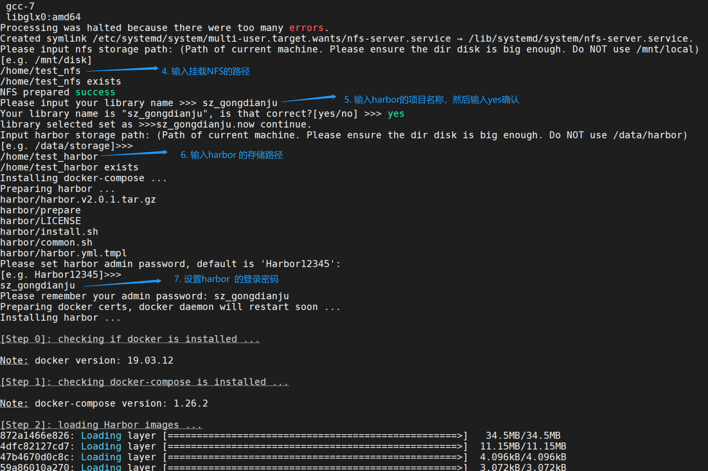

# 华为深度学习系统部署文档

## 一、安装前的准备工作：
1. 设置磁盘阵列，非必须，按需配置，配置文档参考 https://support.huawei.com/enterprise/zh/doc/EDOC1100115323/4d5ef08b
2. 系统必须为 ubuntu 18.04.1
3. 确保所有主机已经配置好root用户；
4. Worker节点的主机需要安装好NVIDIA驱动；
5. 确保/etc/hosts文件中已经配置好了集群节点和docker harbor的域名解析

    * 包括短域名和长域名，短域名格式：IP + 主机名；
    * 长域名格式：IP + 主机名.sigsus.cn；
    * docker harbor域名格式：执行部署脚本的主机IP + harbor.sigsus.cn。  如下图：

    

6. 在安装主机上新建两个空文件夹，一个用来挂载 NFS，一个用做 docker harbor 存储 docker 镜像，必须确保文件夹是空的；  

## 二、安装步骤：

1. 打开安装盘，执行 ./install_DL.sh,开始部署;
2. 略过平台简单的介绍，直接按 enter 键继续;
3. 协议确认：输入 yes 然后 enter 键继续执行脚本;
4. 输入挂载NFS文件夹的路径（安装前新建的NFS空文件夹）;
5. 输入 docker harbor 的项目名称（安装完harbor之后可输入：https://安装主机的IP:8443 no查看，账号为admin）;
6. 输入 docker harbor 的存储文件夹的路径（安装前新建的docker harbor空文件夹）;
7. 设置 docker harbor 的密码，然后开始安装 harbor：

    

8. 输入刚刚设置的 docker harbor 密码，确认登录成功之后，输入 y 继续执行，之后脚本自动开始安装Python依赖包、然后 load 和 push docker 镜像，此过程比较漫长，请耐心等待：

     

9. 配置节点：

    * 第一步：是否使用 master 当作 worker 节点，选择 no,然后回车，开始输入 master 节点；
    * 第二步：设置 master 节点：输入集群中非执行主机的 master 主机名和密码作为 master 节点，可输入多个，输入完 master 节点后，输入 quit 退出，开始配置 worker 节点
    * 第三步: 设置 worker 节点：输入 worker 主机名和密码，之后输入 quit 退出节点配置。

10. 配置告警邮箱:

    
    
11. 平台状态检查：
    * 检查集群pod状态

    `kubectl get pods -n kube-system `

    * 检查平台pod状态

    `kubectl get pods  `

    * 检查GPU状态
        ```
        nvidia-docker run --rm dlws/cuda nvidia-smi
        docker run --rm -ti dlws/cuda nvidia-smi
        ```
    
    * 访问平台
        ```
        # 浏览器访问 http://xxx.xxx.xxx.xxx/home
        # 访问账号可查看前端配置文件 cat /etc/WebUI/local.yaml
        administrators:

            - tomas@163.com

            - steff@example.com

            - jecksun@gmail.com

        用户名为邮箱名，不带后缀，默认密码：123456
        例如：jecksun: 123456
        ```
