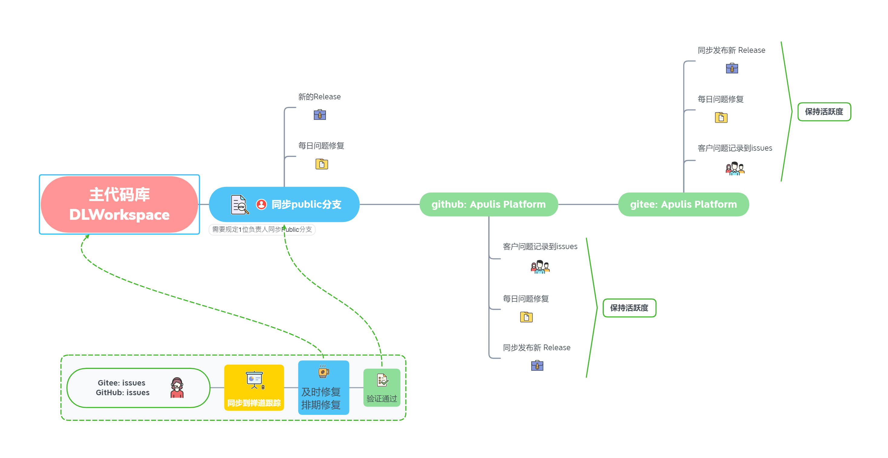

项目代码库基本信息
------------------------------------------------------------------

| ID | 项目                 | 代码库                              | github                          | gitee                          | 权限     | 更新状态 | 维护者  |
|----|---------------------|-------------------------------------|---------------------------------|--------------------------------|----------|----------|---------|
| 1  | 开源项目             | Apulis Platform                     | /apulis/apulis_platform         | /apulis/apulis_platform        | Public   | Updating | haiyuan |
| 2  | 用户管理和权限管理前端| addon_custom_user_group_dashboard   | /apulis/user-dashboard-frontend |/apulis/user-dashboard-frontend | Private   | Stable   | haiyuan  | 
| 3  | 用户管理和权限管理后端| addon_custom_user_dashboard_backend | /apulis/user-dashboard-backend  |/apulis/user-dashboard-backend  | Private   | Stable   | haiyuan  | 

开源版本及同步基本信息
------------------------------------------------------------------

主开发分支-> Public ;
Public ->  (merger)开源版本库.

请看说明文档，develop分支，需执行

1）增加配置config.yaml 

     ssh_port: 22

2) 重新编译init-container

    ./deploy.py --verbose rendertemplate ../docker-images/init-container/ssh_config/sshd/sshd_config.template ../docker-images/init-container/ssh_config/sshd/sshd_config

   ./deploy.py --verbose docker push init-container

* 建议增加版本发布检查项
新增字段这个场景比较少见，必要新增时，需要在mysql中手动增加字段或者手动删除vc表，然后重启restfulapi模块即可
