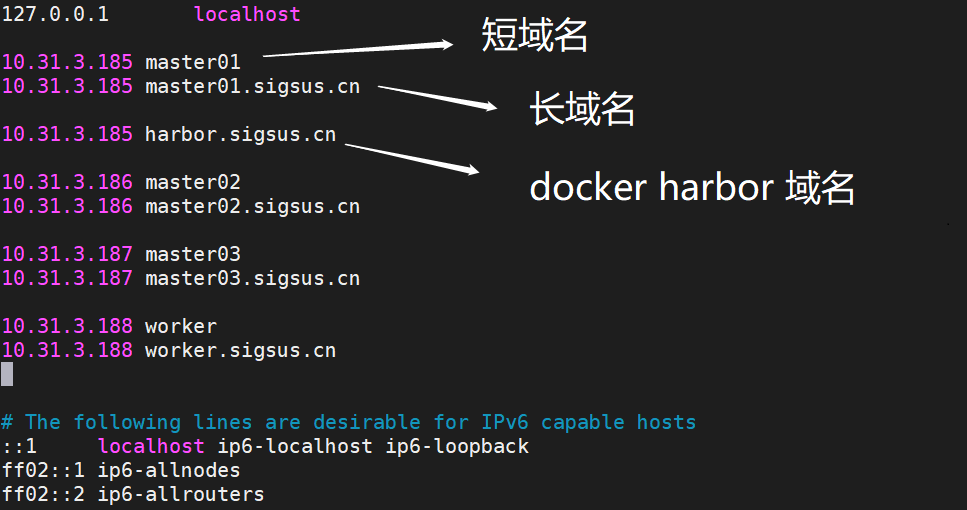
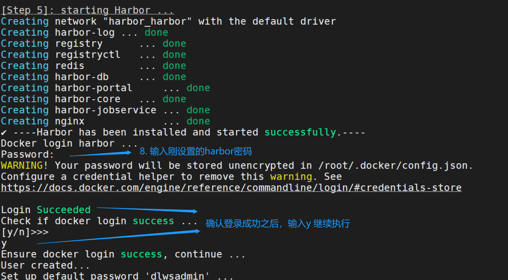
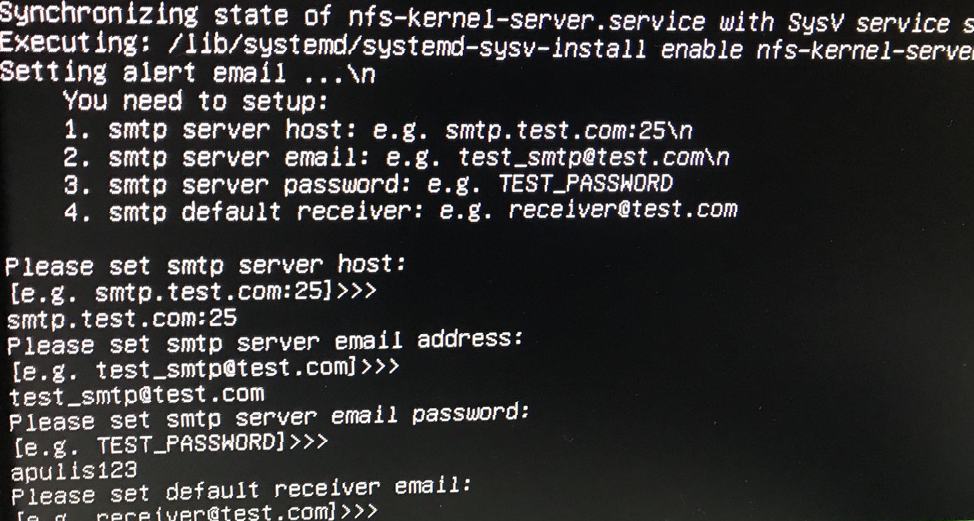

## 一、安装前的准备工作：
1. 设置磁盘阵列，非必须，按需配置，配置文档参考 https://support.huawei.com/enterprise/zh/doc/EDOC1100115323/4d5ef08b
2. 系统必须为 ubuntu 18.04.1
3. 确保所有主机已经配置好root用户；
4. Worker节点的主机需要安装好NVIDIA驱动；
5. 确保/etc/hosts文件中已经配置好了集群节点和docker harbor的域名解析

    * 包括短域名和长域名，短域名格式：IP + 主机名；
    * 长域名格式：IP + 主机名.sigsus.cn；
    * docker harbor域名格式：执行部署脚本的主机IP + harbor.sigsus.cn。  如下图：

    

6. 在安装主机上新建两个空文件夹，一个用来挂载 NFS，一个用做 docker harbor 存储 docker 镜像，必须确保文件夹是空的；  

## 二、安装步骤：

1. 打开安装盘，执行 ./install_DL.sh,开始部署;
2. 略过平台简单的介绍，直接按 enter 键继续;
3. 协议确认：输入 yes 然后 enter 键继续执行脚本;
4. 输入挂载NFS文件夹的路径（安装前新建的NFS空文件夹）;
5. 输入 docker harbor 的项目名称（安装完harbor之后可输入：https://安装主机的IP:8443 no查看，账号为admin）;
6. 输入 docker harbor 的存储文件夹的路径（安装前新建的docker harbor空文件夹）;
7. 设置 docker harbor 的密码，然后开始安装 harbor：

    

8. 输入刚刚设置的 docker harbor 密码，确认登录成功之后，输入 y 继续执行，之后脚本自动开始安装Python依赖包、然后 load 和 push docker 镜像，此过程比较漫长，请耐心等待：

     

9. 配置节点：

    * 第一步：是否使用 master 当作 worker 节点，选择 no,然后回车，开始输入 master 节点；
    * 第二步：设置 master 节点：输入集群中非执行主机的 master 主机名和密码作为 master 节点，可输入多个，输入完 master 节点后，输入 quit 退出，开始配置 worker 节点
    * 第三步: 设置 worker 节点：输入 worker 主机名和密码，之后输入 quit 退出节点配置。

10. 配置告警邮箱:

    
    
11. 平台状态检查：
    * 检查集群pod状态

    `kubectl get pods -n kube-system `

    * 检查平台pod状态

    `kubectl get pods  `

    * 检查GPU状态
        ```
        nvidia-docker run --rm dlws/cuda nvidia-smi
        docker run --rm -ti dlws/cuda nvidia-smi
        ```
    
    * 访问平台
        ```
        # 浏览器访问 http://xxx.xxx.xxx.xxx/home
        # 访问账号可查看前端配置文件 cat /etc/WebUI/local.yaml
        administrators:

            - tomas@163.com

            - steff@example.com

            - jecksun@gmail.com

        用户名为邮箱名，不带后缀，默认密码：123456
        例如：jecksun: 123456
        ```

附：自动化安装脚本使用步骤
----------------------------------------------------------------------

### 环境准备

1. Nvidia-driver 440.33
2. Nvidia GPUs
3. Cuda 10.2
4. Ubuntu 18.04
5. The *X86* architecture system

### 1. 使用install_pan.sh进行安装盘制作

```shel
./install_pan.sh -c -d <docker_images_directory> -p <install_dirrectory>
```

#### 参数解释

* -c：在下载安装所需的apt package的时候，同时下载依赖包。
* -d：指向docker镜像的存放目录，该路径应当在根目录下存放所有镜像的tar打包文件，并且没有其他文件或者目录。。
* -p：指向安装目录，该目录在脚本运行结束后需要拷贝到目标主机。

#### 注意事项

1. 请使用root用户执行脚本。
2. 使用脚本时，在实例命令中将"<>"内的内容替换为相应的路径位置。

2. 使用安装脚本的主机与安装目标主机需要拥有相同的操作系统、架构类型，并保证apt安装源最新。

3. 执行完成后，安装目录应当有以下文件和文件夹：

* install_DL.sh
* install_workernode.sh

- YTung.tar.gz
- config目录
- apt目录
- docker-images目录
- python2.7目录

### 2. 将安装目录拷贝到安装目标主机上

### 3. 进行安装前的配置检查

检查内容

* 需要在master节点来执行install_DL.sh

* 所有主机已经配置好root用户，并且拥有密码。

* 所有安装GPU的主机都安装好nvidia 440版本驱动。

* 确保master节点上/etc/hosts文件中已经配置好了集群所有节点（包括master自身的）的域名解析，包括短域名和长域名。短域名需要与主机名相同，长域名以：**主机名.sigsus.cn**的形式配置。

  例如，master节点主机名为ubuntu-master,则/etc/hosts文件中至少应该有以下两条记录：

  ​	xxx.xxx.xxx.xxx ubuntu-master

  ​	xxx.xxx.xxx.xxx ubuntu-master.sigsus.cn

* 请确保config.yaml文件配置与集群信息匹配，如果不知道config.yaml文件的配置情况，请与管理员联系。

### 4. 使用install_DL.sh进行安装

请按照提示完成安装，按照顺序，你应当会遇到以下需要输入的内容：

1. 欢迎界面，请按回车继续。

2. 条款确认，请输入yes继续。

3. 是否允许将master节点当作worker调度，请选择yes。（仅限于测试版本）

4. 配置worker节点信息，将会需要输入节点域名，请注意此时应当输入短域名，该短域名与该worker主机名相同；

   在配置节点信息的部分，请在任何需要确认的部分输入yes确认来完成节点间的knownhost配置，并在需要输入密码的部分输入root那么；

   配置完第一个节点以后，可以继续配置节点（此时应该是需要输入下一个节点的域名），也可以输入”quit“退出配置。

安装时间比较长，请保持耐心等待。

